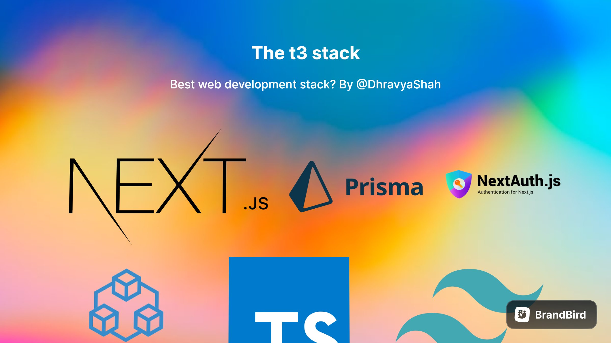

# tRPC with Next.js, TypeScript & Prisma



## Why you should be learning & using tRPC

- Making E2E type-safe APIs is fun and easy
- Gives you a deeper understanding of Next.js
- Going to be very popular (prediction)

## Technologies used

- tRPC
- TypeScript
- Prisma (Postgres)
- Zod - Schema validation & type generation
- nodemailer - Sending OTP emails
- Next.js
- TailwindCSS
- Typescript
- Tailwind CSS
- React Hook Form
- React Query
- React Icons
- React Toastify
- React Testing Library
- SuperJSON
- JSON Web Token
- ESLint
- Prettier
- Husky
- Jest
- Prisma
- MongoDB
- Docker

[See the aplication](https://meru-ecommerce.vercel.app/) 👀

## Welcome! 👋

\*\* Frontend Technologies 🛠

# Next.js Coffee Shop

for run in local you need the local database

```
docker-compose up -d
```

- MongoDB URL Local:
  yarn install
  yarn dev

```
  mongodb://localhost:27017/coffee-shop
```

## fill the database for test with dummy data

```
  http://localhost:3000/api/seed
```

## Pre-requirements 📋

- Node
- Npm

## Run app " Development " ⚙️

```
1.- npm install or yarn install
2.- npm run dev or yarn dev  --Mode development
```

## Run app " Production " 🚀

```
1.- npm install or yarn install
2.- npm run build or yarn build
3.- npm run start or yarn start  --Mode production
```

## Deployment 📦

- [Vercel](https://vercel.com/) - Vercel

_Tools I've used in this project_

- [React](https://es.reactjs.org/) - React
- [NextJs](https://nextjs.org/) - NextJs
- [Next Auth](https://next-auth.js.org/) - Next Auth
- [Axios](https://axios-http.com/) - Axios
- [React Query](https://react-query-v3.tanstack.com/) - React Query
- [React Hook Form](https://react-hook-form.com/) - React Hook Form
- [React Icons](https://react-icons.github.io/react-icons/) - React Icons
- [React Toastify](https://fkhadra.github.io/react-toastify/introduction) - React Toastify
- [React Spinners](https://www.npmjs.com/package/react-spinners) - React Spinners
- [Tailwind](https://tailwindcss.com/) - Tailwind
- [Express JS](https://expressjs.com/) - Express JS
- [MongoDB](https://www.mongodb.com/) - MongoDB
- [Prisma](https://www.prisma.io/) - Prisma ORM
- [Typescript](https://www.typescriptlang.org/) - Typescript
- [Zod](https://zod.dev/) - Zod
- [React Testing Library](https://testing-library.com/) - React Testing Library

## Author ✒️

_Developed by_

- **Ismael JDz7** - _Frontend-Developer_ - [IsmaelJdz7](https://github.com/IsmaelJDz)

---

⌨️ with ❤️ by [IsmaelJDz7](https://github.com/IsmaelJDz) 😊
